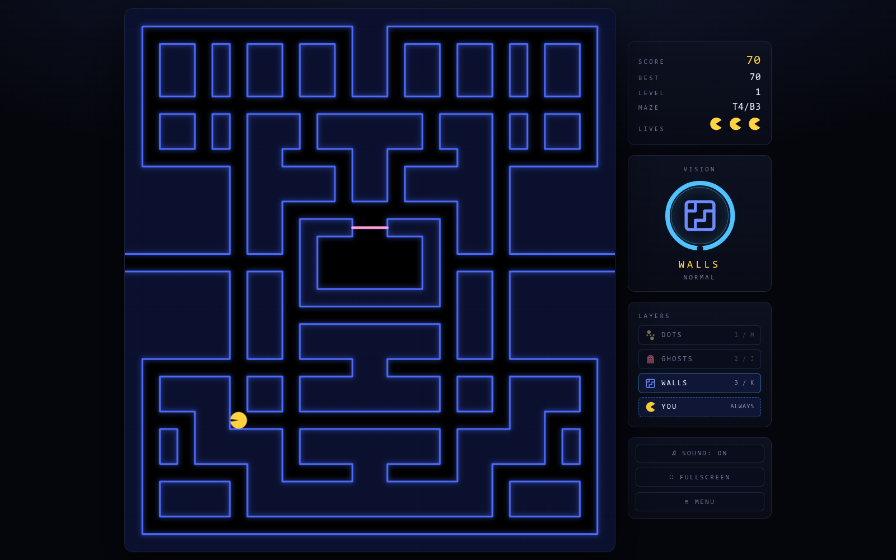
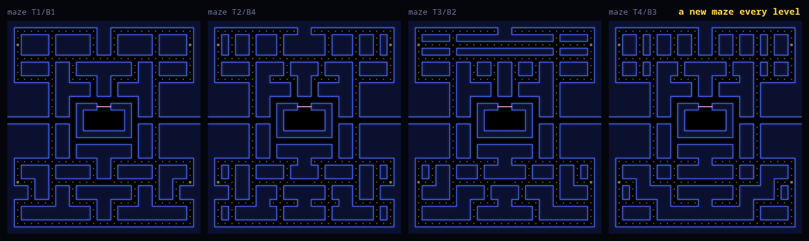

# BLINK-MAN

A maze chase drawn one layer at a time.

Dots, ghosts, walls and you are four separate layers, and only one of them is
on screen. You choose which with a key press, then wait out a cooldown before
you can switch again. Everything else is black.

Most player-facing wording lives in `js/strings.js`, including `description`,
the plain line above that feeds the meta tag, and `splashes`, the pool of
Minecraft-style one-liners the menu picks from at random. Add to the pool
freely. A few strings stay in the markup because no JavaScript runs to fill
them or because they're attributes: the `<title>`, the `<noscript>` line, the
aria-labels and the button tooltips.

The name of the arcade game this descends from appears in this README and in
code comments, where it's the clearest way to explain a design decision, but
never in anything a player or a storefront sees.

## Running it

Any static server works:

    python3 -m http.server 8000

Opening `index.html` directly works too. There's no build step and nothing to
install. High scores are the only thing a server buys you, since Chrome blocks
`localStorage` on `file://`.

Desktop and keyboard only. The board grows to fill the window.

## Controls

| | |
|---|---|
| Arrows or `WASD` | Move |
| `1` `2` `3` `4` or `H` `J` `K` `L` | Show dots / ghosts / walls / you |
| `P` `R` `M` `F` | Pause, restart, mute, fullscreen |
| `Esc` | Menu |

The badge on the right shows the layer you're on, ringed by its cooldown. Full
blue ring means you can switch. A shrinking red arc means wait.

## Modes

Three ways of seeing, each with three difficulties. The mode decides what a
press does; the difficulty decides how much it gives you.

| | What a press does |
|---|---|
| Stare | Lights one layer, and it stays lit until you pick another. |
| Torch | A lit circle and a forward cone travel with you, both stopping at walls. A press pings one layer outward from where you stood, through walls. |
| Flash | The board is black. A press flashes one layer, which then fades. |

| | Easy | Normal | Hard |
|---|---|---|---|
| Stare | Your last two picks, 1s | Your last pick, 1s | One of four and you can go dark, 3s |
| Torch | A wide cone that reaches, 1s | A 6-tile cone, 1s | A narrow cone, quick to fade, 2s |
| Flash | You stay lit, a 3.5s fade, 1s | A 2s fade, 1s | A 1s fade, 2s |

Your own layer is free in every cell except Stare Hard, Flash Normal and Flash
Hard, which is what makes those three the ones where you can lose yourself.

Death is the one exception to all of this. Get caught and the ghosts light up
for 0.6s before the death animation, with a red ring on whichever one got you,
so a death always has a visible cause.

The menu runs a demo behind it: a Stare Normal round on autopilot, with the lit
layer rotating every four seconds. `prefers-reduced-motion` turns it off.

A round opens the same way in every mode. The dots blink three times and then
obey the layer, and all four ghosts start in the house and file out one at a
time over the first several seconds. A ghost inside the house is visible
whatever the layer says, fading out as it crosses the door, so you can count
what is still waiting. Torch opts out of that: it brings its own light, so the
house stays dark and who is still in it is something you walk up to or ping
for. Pac-Man starts Blinky outside the house; keeping all four in makes the
count readable, which matters more here than the pedigree.

Five seconds into a round, a player who hasn't pressed a number key gets a line
low on the board naming the ones that mode answers to — `Press 1/2/3 to scan`
in Torch, `Press 1/2/3/4 to flash` in Flash. Flash Easy is the exception at
`Press 1/2/3`, since it draws you always and never spends a flash on you. It
fades after ten seconds and returns each round until a pick is made, then stays
gone for the rest of the game.

## Mazes

Every level builds a new maze, so you can't coast on memory. It isn't a random
generator though. A fixed skeleton holds the parts that make it feel like
Pac-Man: the border, the tunnel row, the ghost house, the perimeter corridors
and the spine at column 6. Only the wall blocks between them change, drawn from
four top pieces and four bottom pieces. Sixteen combinations, mirrored left to
right like the original. The HUD shows which pair you got.

Mazes only change between levels, so dying never costs you pellet progress.

To add pieces, edit `TOP_PIECES` and `BOTTOM_PIECES` in `js/maze.js`. Three
rules apply, and the test enforces all three:

1. Everything must be reachable from Pac-Man's spawn.
2. No 2x2 block of open floor. Real Pac-Man mazes have none, and a two-wide
   corridor lets a ghost slide past you in the same passage. In practice a
   two-row band between fixed corridors can only hold vertical corridors, and
   corridor columns can't sit next to each other.
3. No dead-ends. Every open tile needs at least one walkable neighbour beyond
   the one it's reached from; the two tunnel mouths are the only exception.

    node test/maze-test.js

One more guideline, not test-enforced: when closing a dead-end into a
corridor, leave at least 2 straight tiles before the next turn.

`PV.createMaze(seed)` is deterministic, so any maze can be reproduced from its
seed. At runtime a piece that leaves something unreachable gets logged and
falls back to the arcade layout rather than shipping a broken level. The
two-wide and dead-end checks are test-only, so run the test after editing pieces.

## Code

Plain scripts hanging off a `window.PV` global. No modules, no bundler, which
is what lets `file://` work.

    js/strings.js   every player-facing word
    js/maze.js      maze pieces, assembly, pellets, passability
    js/entities.js  grid movement, ghost targeting
    js/vision.js    the layer and cooldown state machine
    js/game.js      rounds, scoring, collisions, ghost release
    js/attract.js   the autopilot demo behind the menu
    js/render.js    canvas drawing
    js/hud.js       score, badge, cooldown ring, the layer nudge
    js/menu.js      the mode and difficulty picker on the title screen
    js/audio.js     synthesised sound, no audio files
    js/main.js      input, frame loop, layout

`maze.js` has to load before `vision.js`, `entities.js`, `render.js` and
`game.js`, which read `PV.TILE`, the board size and the spawn table at load
time. `attract.js` reads `PV.DIRS` and the grid size, so it comes after
`entities.js` too. `main.js` has to load last. Everything else in the script
order is slack.

Seven test suites, five node and two bash, none of them needing anything
installed. The second covers the ghost release ladder, the house reveal, the
dots blink and the wording of the layer nudge; the third covers Torch — its
ping's fade curve and frozen origin, the ghost blips it leaves behind, and the
line-of-sight and circle/cone math behind what the light itself reaches; the
fourth covers the menu demo, whose autopilot has to steer only into open tiles,
eat at a reasonable rate, and reach every layer as it rotates; the fifth pins
the shape of all nine cells and the exact tuning each mode's Normal is
balanced around, so a change to it has to be deliberate. None of that is
visible to a layout check. The last two are bash because what they exercise is
bash; `release-test.sh` drives `tools/release.sh` against a throwaway repo, so
nothing it does reaches GitHub.

    node test/maze-test.js
    node test/opening-test.js
    node test/torch-test.js
    node test/attract-test.js
    node test/modes-test.js
    bash test/release-test.sh
    bash test/itch-deploy-test.sh

The game always draws into a fixed 560x620 space and a canvas transform maps
that onto whatever size the board actually is. Nothing in the game logic knows
the screen size, and the maze stays sharp instead of being a stretched bitmap.
`PV.game` is exposed for poking at state from the console.

Editing a file and seeing nothing change usually means the browser cached the
old one. Hard reload with Ctrl-Shift-R.

## Publishing

    ./tools/release.sh 1.6.0

Bumps `PV.VERSION`, commits, tags `v1.6.0` and pushes. The tag triggers
`.github/workflows/deploy.yml`, which checks the tag against `PV.VERSION`, runs
the game suites, packages the zip, pushes it to itch.io and creates a GitHub
release.

To ship a build without cutting a version, `./tools/itch-package.sh` builds the
zip and `./tools/itch-deploy.sh` pushes it. `docs/itch.md` covers the store
page, which stays manual.

## License

MIT. See `LICENSE`.

The licence covers this code, not the arcade game it takes after. If you build
on it, keep someone else's trademark out of anything a player or a storefront
sees, the way this does.

## Not done

- No bonus fruit.
- Ghosts do scatter/chase with the four classic personalities, but skip the
  arcade's speed tables and exact house dot counters.
- Collision is a radius check rather than the arcade's tile test, so it's a
  little more forgiving.
- The synthesised sound has never been checked on real speakers.
